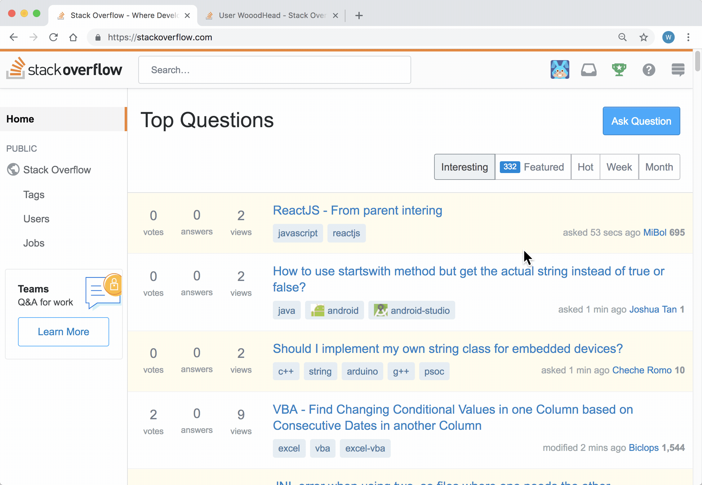

# stackoverflow-favorite-as-history
A chrome extension that stars every question you viewed on stackoverflow.com, so that favorites list can work like history. For example: https://stackoverflow.com/users/3317931/scott?tab=favorites

Inspired by: [https://meta.stackexchange.com/questions/78099/personal-history-of-recently-viewed-questions](https://meta.stackexchange.com/questions/78099/personal-history-of-recently-viewed-questions)

# Install

## Chrome web store
https://chrome.google.com/webstore/detail/stackoverflow-favorite-as/iaoghjfbfbfdkbcldeamjiiolkdacmdd

